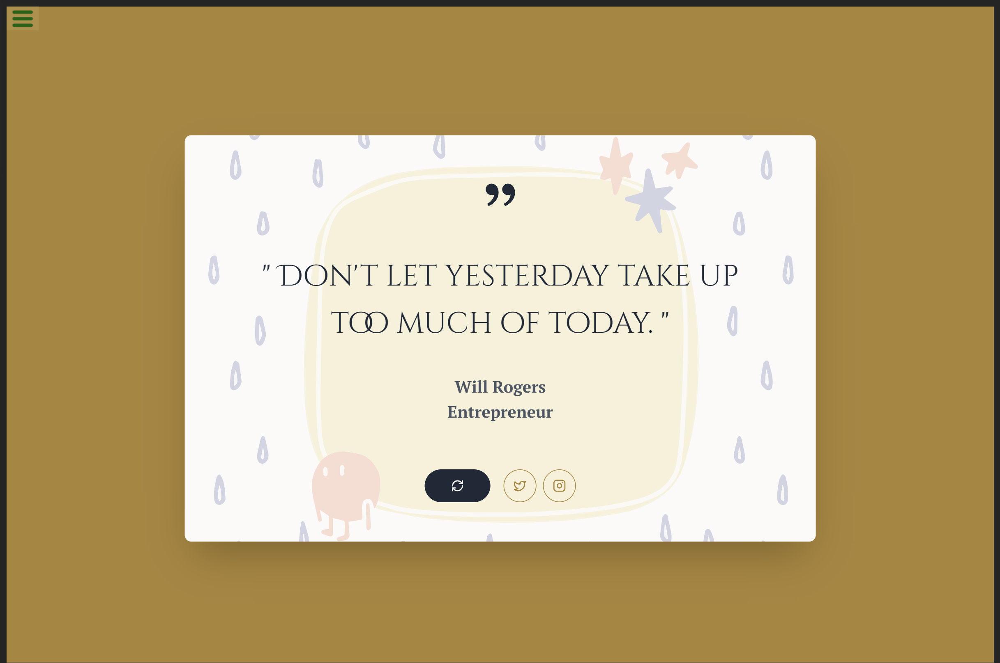

# Random Quote Machine

A dynamic and visually appealing random quote generator built with React, Vite, and TypeScript. This project features smooth animations for quote transitions and allows users to share their favorite quotes on social media.

This project fulfills the requirements for the [Random Quote Machine](https://www.freecodecamp.org/learn/front-end-development-libraries/front-end-development-libraries-projects/build-a-random-quote-machine) challenge from the freeCodeCamp Front End Development Libraries curriculum.

---

## 📸 Screenshot

_(It's recommended to add a screenshot or a GIF of your project in action here!)_



---

## ✨ Features

- **Random Quotes**: Fetches and displays random quotes from a local JSON data source.
- **Smooth Animations**: Implements CSS animations for quote text, background color changes, and button interactions.
- **Get New Quote**: A dedicated button to load a new random quote on demand.
- **Social Sharing**:
  - Share the current quote directly on Twitter.
  - Share a link to the app on Instagram.
- **Responsive Design**: A clean and responsive layout that works on various screen sizes.
- **Modern Tech Stack**: Built with React, Vite, and TypeScript for a fast and type-safe development experience.

---

## 🛠️ Tech Stack

- **[React](https://react.dev/)**: A JavaScript library for building user interfaces.
- **[Vite](https://vitejs.dev/)**: A next-generation frontend tooling that provides a faster and leaner development experience.
- **[TypeScript](https://www.typescriptlang.org/)**: A typed superset of JavaScript that compiles to plain JavaScript.
- **[CSS3](https://developer.mozilla.org/en-US/docs/Web/CSS)**: Used for custom styling and animations.
- **Icons**:
  - **[Lucide React](https://lucide.dev/)**
  - **[React Icons](https://react-icons.github.io/react-icons/)**

---

## 📂 Project Structure

Here's a brief overview of the key files in this project:

```
src
├── assets
│   └── quotes.json     # Contains the array of quotes, authors, and professions.
├── App.css             # Main stylesheet for animations and component styling.
├── Component.tsx       # The main React component for the quote machine UI and logic.
└── main.tsx            # The entry point of the React application.
```

- **`src/Component.tsx`**: This is the heart of the application. It manages the state for the current quote, handles animations, and contains the logic for fetching new quotes and sharing on social media.
- **`src/assets/quotes.json`**: A simple JSON file that acts as a local database for the quotes.
- **`src/App.css`**: Contains all the custom CSS, including styles for the layout, buttons, and the keyframe animations for quote transitions and the spinning refresh icon.

---

## 📄 License

This project is licensed under the MIT License - see the LICENSE.md file for details.
